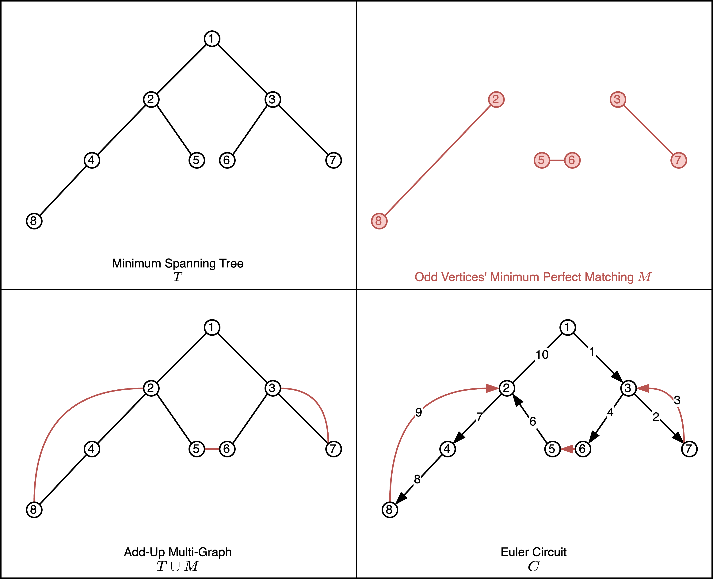
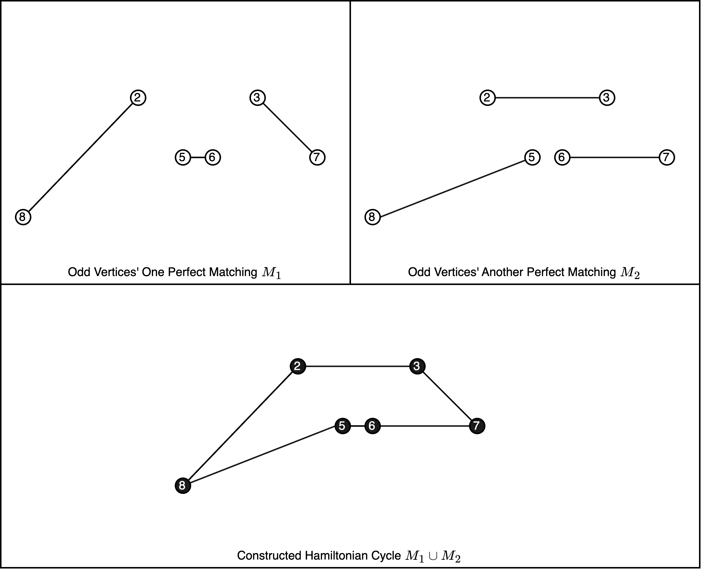
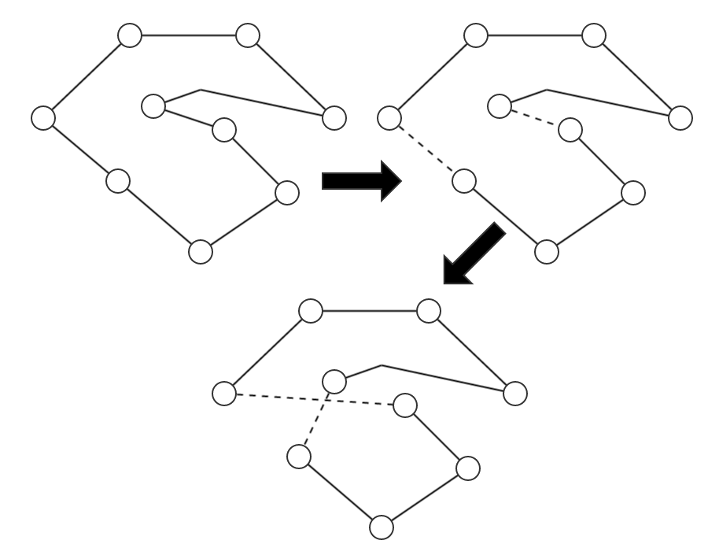

# Traditional Algorithms for Symmetric Traveling Salesman Problem with Average Relative Error Rate 4.38%

## Benchmark 测试用例

⏱️海德堡大学（Heidelberg University）教授Gerhard Reinelt维护的网站[TSPLIB](http://comopt.ifi.uni-heidelberg.de/software/TSPLIB95/)包含TSP问题的benchmark数据。

```commandline
gzip -d *.gz
```

🧮为EUC_2D类型（两点间距离须四舍五入取整）且城市数小于等于1000的测试用例，共计48个。

## Description 问题描述

🤯旅行商问题是一个典型的NP难度问题，可描述为平面上给定n个点，每两点之间的直线距离是已知的正实数，从某一个起点出发，经过其余点恰好一次，最后回到起点。要求给出一种巡回旅行走法，使得回路的长度最短。

1. 旅行商问题的类自然语言描述如下：给定$`n`$个城市，对这$`n`$个城市中的每两个城市来说，从一个城市到另一个城市所走的路程是已知的正实数，其中$`n`$是已知的正整数，$`n \ge 3`$。这$`n`$个城市的全排列共有$`n!`$的阶乘个。每一个这$`n`$个城市的全排列都恰好对应着一种走法：从全排列中的第一个城市走到第二个城市，……，从全排列中的第$`n-1`$个城市走到第$`n`$个城市，从全排列中的第$`n`$个城市回到第一个城市。要求给出一个这$`n`$个城市的全排列$`\sigma`$，使得在$`n!`$个全排列中，全排列$`\sigma`$对应的走法所走的路程是最短的。

> ▶️符合三角形三条边关系定则
>
> ⬇️严格来讲，由于起点任意、顺逆时针等价，问题复杂度为$`\frac{\left(n-1\right)!}{2}`$

2. 旅行商问题的形式化描述：给定一个有向完全图$`G=\left(V,A\right)`$，其中集合$`V=v_1,\ldots,v_n`$是顶点集合，每个顶点代表一个城市，n是顶点数（$`n\ge 3`$），集合$`E=\left(v_i,v_j\right)|v_i,v_j\in V,v_i\neq v_j`$是有向边集合。 $`d_{ij}`$是有向边$`\left(v_i,v_j\right)`$的长度，$`d_{ij}`$是已知的正实数，其中$`\left(v_i,v_j\right)\in E`$。集合$`\Sigma`$是顶点全排列的集合，共有$`n!`$元素。$`\sigma`$是所有顶点的一个全排列，$`\sigma=\left(\sigma\left(1\right),\ldots,\sigma\left(n\right)\right)`$，$`\sigma\in\Sigma`$， $`\sigma\left(i\right)\in V`$，$`1\le i\ \le n`$。 $`\sigma`$对应着一条遍历所有顶点的回路：从顶点$`\sigma(1)`$走到顶点$`\sigma(2)`$，……，从顶点$`\sigma(n-1)`$走到顶点$`\sigma(n)`$，从顶点$`\sigma(n)`$回到顶点$`\sigma(1)`$。全排列$`\sigma`$所对应的回路的长度记为$`H(\sigma)`$，$`H(\sigma)=d_{\sigma(1) \sigma(2)} + ... + d_{\sigma(n-1) \sigma(n)} + d_{\sigma(n) \sigma(1)}`$。目标是给出所有顶点的一个全排列$`\sigma^*`$，使得$`H(\sigma^*)= \underset{\sigma \in \Sigma}{\min} (H(\sigma))`$。

> 🪞每一对顶点$`v_i`$ 和 $`v_j`$来说，都有$`d_{ij} = d_{ji}`$成立，那么称问题是对称的（Symmetric traveling salesman problem）； 否则称问题是非对称的（Asymmetric traveling salesman problem）。

## Algorithm 演算法

🧄求解旅行商问题的算法设计可分为两类：完整算法和近似算法。

1. 完整算法保证给出最优解，但计算时间太长，仅可用于计算较小规模实例；
2. 近似算法，或许有可能在短时间内，给出相当接近最优解的近似解。非随机性近似算法包括构建式启发/贪婪算法，克里斯托菲德斯算法；随机性近似算法包括随机局域搜索、模拟退火、遗传算法、群智感知算法等。

🤖️*使用深度学习（Deep Learning）建模配合强化学习（Reinforcement learning）策略，`人工智能`，能不能与近70年来的`人类智能`
相抗衡？一般认为：深度学习处理`模式识别/特征提取`比较好；深度学习求解`组合优化`问题，至今没有比较好的结果。不过，未来将至，未可知。

> The field of Combinatorial Optimization is pushing the limit of deep learning. Traditional solvers ***still*** provide
> better solutions than learning models. However, traditional solvers have been studied since the 1950s and the interest
> of applying deep learning to combinatorial optimization has just started.
>
> ——*The Transformer Network for the Traveling Salesman Problem*

> Specifically, taking the traveling salesman problem as the testbed problem, the performance of the solvers is assessed
> in five aspects, i.e., effectiveness, efficiency, stability, scalability, and generalization ability. Our results show
> that the solvers learned by NCO approaches, in general, ***still fall short*** of traditional solvers in nearly all
> these aspects. A potential benefit of NCO solvers would be their superior time and energy efficiency for small-size
> problem instances when sufficient training instances are available.
>
> —— *How Good Is Neural Combinatorial Optimization? A Systematic Evaluation on the Traveling Salesman Problem*

### Fundamentals 基石算法实现

#### 🏠构建式启发/贪婪算法（Constructive heuristics）

🍵主要是逐步插入点（边），最后得到一个包含所有城市的回路。例如：

+ 贪心最近邻点算法：首先选择一个城市作为起点，然后用贪心法，每步均选择距离当前所在城市最近的未访问城市，最后回到起点。
+ 贪心最短链接算法：选择符合要求的长度最短的边加入解集，直至边集完整构成一个哈密尔顿回路。要求如下：添加该边后，无法形成长度小于城市（顶点）数目的环，也无法形成“某城市（顶点）的度大于2”的格局。
+ 钉绳插入策略：按照选取城市的具体规则，插入算法可分为几种，分别为最小插入法（cheapest）、最近插入法（nearest）、最远插入法（farthest）、随机插入法（random）。无论是哪一种插入算法，在插入新城市时，都会选择路线上最合适的位点，使插入后的路线长度最短。

> 王磊基本算法：可以首先生成一个3城市回路，然后依照一定次序（可以结合后续随机化跳坑策略），用贪心法将未访问城市插入回路，选择部分回路长度最短的动作，最后，得到包含所有城市的回路。

#### 🌲克里斯托菲德斯算法（Christofides–Serdyukov algorithm）

👍可证明，最差情况下，该近似算法所得回路长度不会超过最优回路长度的**1.5**倍。

> 🥁对于近似算法求最小值问题，设 $`Opt`$ 是最优解，$`x`$ 表示某算法给出的一个解，一般规定，$`Opt\le x\ \le\alpha\times Opt`$，$`\alpha`$记为该算法的近似比，作为评价算法优劣的指标之一。
>
> 🈚️拟物仿生万用启发算法（又称元启发算法，metaheuristic），虽然有可能得出比较好的近似解，但往往不涉及在最差情况下的效率证明。

✍️基于“最小生成树”的经典非随机性近似算法有两种，分别符合`2`和`1.5`的近似比。

##### 引入：近似比为2的算法（2-Approximation）

1. 定义：$`S`$代表一系列边（允许重边），$`c\left(S\right)`$代表各边权重（长度）之和。
2. 定义：$`H_G^\ast`$为无向多重图$`G`$上，长度最短的哈密尔顿回路（Hamiltonian Cycle），途中经过所有点且只经过一次。
3. 构造最小生成树$`T`$，根据最小权生成树定义，$`c\left(H_G^\ast\right)\geq c\left(H_G^\ast-e\right)\geq c\left(T\right)`$。


4. 按深度优先搜索次序记录回路$`C`$，下探一次，回溯一次，因此$`c\left(C\right)=2\times c\left(T\right)`$。例如，1，2，3，2，4，2，1，5，1，6......1。
5. 搭桥（short-cut/bypass）略过重复访问的点得到符合问题描述的新回路$`C^\prime`$（最后回到起点），例如，1，2，3，4，5，6......1。

> 问题要求商人巡回旅行最后回到起点，省略号前是$`1~n`$的一个排列。


6. 证明：
    - 由e、三角形三条边关系定则，$`c\left(C^\prime\right)\le c\left(C\right)`$；
    - 由c，$`c\left(H_G^\ast\right)\geq c\left(H_G^\ast-e\right)\geq c\left(T\right)`$；
    - 由d，$`c\left(C\right)=2\times c\left(T\right)`$；
    - 故$`c\left(C^\prime\right)\le2c\left(H_G^\ast\right)`$；即得证。
    - 因此，该近似算法所得解，最多也不会超过最优解的2倍。

##### 主体：近似比为1.5的算法（1.5-Approximation）

> 仍基于最小生成树，想方设法减小“每边下探一次，回溯一次”带来的额外开销。
>
> `一笔画`、`不重边`地遍历所有顶点，可以将问题转换成`欧拉回路`问题。无向图存在欧拉回路的充要条件为：该图为连通图，且所有顶点度数均为偶数。
>
> 倘若`奇度数`顶点为偶数个（证明见下），那么可以通过将其***两两匹配***，为每一个顶点都`附赠`
> 一个度，这样便可以满足`顶点度数均为偶数`条件。

1. 定义：$`S`$代表一系列边（允许重边），$`c\left(S\right)`$代表各边权重（长度）之和。
2. 定义：$`H_G^\ast`$为无向多重图$`G`$上，长度最短的哈密尔顿回路（Hamiltonian Cycle），即途中经过所有点且只经过一次。
3. 定义：假设$`S`$为无向多重图$`G`$上的导出子图，在$`S`$上长度最短的哈密尔顿回路记为$`H_S^\ast`$。根据三角形三边关系定则易证，$`c\left(H_S^\ast\right)\le c\left(H_G^\ast\right)`$。
4. 构造最小生成树$`T`$，根据最小权生成树定义，$`c\left(H_G^\ast\right)\geq c\left(H_G^\ast-e\right)\geq c\left(T\right)`$。
5. 分离在$`T`$上度数为奇数的点，生成导出子图$`S`$（根据握手定理，给定无向图$`G=\left(V,E\right)`$，一条边贡献2度，故有$`\Sigma degG\left(v\right)=2\left|E\right|`$；除开度数为偶数的顶点所贡献的度数，推论可知，度数为奇数顶点数有偶数个）；
6. 构造$`S`$的最小权完美匹配$`M`$，构造多重图$`G^\prime=T\ \cup M`$（此时每个顶点均为偶数度，故存在欧拉回路）；




7. 生成$`G^\prime`$的欧拉回路$`C`$，$`c\left(C\right)=c\left(T\right)+c\left(M\right)`$;
8. 搭桥（short-cut/bypass）略过重复访问的点（起点终点不删）得到符合问题描述的新回路$`C^\prime`$（最后回到起点）。
9. 证明：
    - 由e、三角形三边关系定则，$`c\left(C^\prime\right)\le c\left(C\right)`$；
    - 由d，$`c\left(H_G^\ast\right)\geq c\left(H_G^\ast-e\right)\geq c\left(T\right)`$；
    - 由g，$`c\left(C\right)=c\left(T\right)+c\left(M\right)`$；
    - 由f、c，$`c\left(M\right)+c\left(M\right)\le c\left(M1\right)+c\left(M2\right)=c\left(H_S^\ast\right)\le c\left(H_G^\ast\right)`$。
    - 故$`c\left(C^\prime\right)\le c\left(T\right)+c\left(M\right)\le c\left(H_G^\ast\right)+\frac{1}{2}c\left(H_G^\ast\right)`$
   $；即得证。



#### 基于邻域跳坑的（元）启发算法

> TSP领域，最基本的定理可能要数这一条：如果题目数据使用欧几里得距离，那么最优路线必定不会自交。

贝尔实验室的Lin倡导使用路线改进算法。 这类算法名副其实，读取一条路线后，便会查漏补缺，对其调整修正。"怎么改"，自然对应着一种"操作"（也被称为"邻域算子"）。

##### 邻域结构

解空间中的一个巡回旅行路线直接或间接对应一个全排列$`\sigma=\left(\sigma\left(1\right),\ldots,\sigma\left(n\right)\right)）`$。将其视作$`n`$维空间中的一个点，其邻域$`\sigma^\prime`$操作有很多种，如插入、块插入、点对换、边重组等等。

其中，最著名的是2-交换（2-opt）、3-交换（3-opt）和更多边的交换（k-opt）操作。

> 例如，2-交换的步骤就是删除路线中的两条边，用另外两条更短的边重新连接，是路径连为一体。反复使用2-交换基本操作（邻域算子）改进路线，就可以在很大程度上改进"虎头蛇尾"、"目光短浅"的最近邻路线。
> 

> 编码实现3-交换时，画的草稿：
> 

> k-交换方法虽然在应用中表现出了优秀的性能，在理论上却无法保证优良的最差情况性能。即便如此，使用该算法时也不必过分担心，因为它是算法中的王者，一般情况下都确实能够得到非常好的解。
> 
> Lin-Kernighan
> 
> Lin-Kernighan-Helsgaun
> 
> —— In Pursuit of the Traveling Salesman: Mathematics at the Limits of Computation


##### 跳坑思想

处理TSP问题的常见思路之一是：先使用非随机性启发算法获得一个相对合理的解，再进行后处理，使用万用启发式算法跳出局部最优，以期待结果有所提升。这仿佛王磊老师经常说的，“如果你期末总评已经满绩了，就要见贤思齐，到更有希望的区域继续提高。”

不过，**_“大智”常常“若愚”，“峰回”方有“路转”，谁说“错棋”不能“封神”，谁说“绝处”不能“逢生”_**
；如果一个人时时刻刻都太精明，反而让人生烦，不利于开展工作。因此，我认为，更为精明的跳槽策略，企业家的儿子先苦心志、劳筋骨，先去稍微比董事长低一点的职位试试水，甚至瞎猫碰上死耗子，跌跌撞撞直接去基层工作也不是不可，带着民间智慧总能回来继承家业，发扬光大的。也就是说：

- 若新位置明显优于旧位置，则跳转至新位置；
- 纵使新的位置不如旧位置，也要以“一定概率”跳转至新位置。

##### 模拟退火

事实上，人们从物理世界状态演化、自然界各种现象、千百年来生存斗争经验获得启发，以仿生拟人拟物途径设计了各种千奇百怪五花八门的算法。
模拟退火（Simulated Annealing）就是其中一种，具有自然背景，且实现简单。

模拟退火的超参数包括：初始温度、终止温度、指数衰减系数、运行时间。

模拟退火的通用步骤是：

1. 在解空间选择一个初始格局$`\sigma`$；
2. 温度以一定系数衰减，若小于终止温度，算法停机；否则，循环执行c；
3. 邻域搜索：在当前格局的周围（随机点边对换等）找一个邻近格局$`\sigma^\prime`$，根据度量指标计算优劣$`\Delta E=E\left(\sigma^\prime\right)-E\left(\sigma\right)`$（E越小越好），跳坑策略：
    - 如果$`\Delta E\ <0`$，则直接令$`\sigma=\sigma^\prime`$；
    - 如果$`\Delta E\ \geq0`$，以$`e^{-\frac{\Delta E}{T}}`$的概率，令$`\sigma=\sigma^\prime`$。

上述通用步骤重置启动，若干次。其中，E代表巡回旅行路线长度。

## Proposed Strategy 算法策略设计

步骤一：使用1.3.1最近邻、1.3.2克里斯托菲德斯算法计算巡回旅行路线。
> 受《求解二维矩形Packing问题的一种优美度枚举算法》的启发，对于最近邻而言，进行如下改进：我们在生成的所有路线中，取前m条进行2-opt随机化改进（这是一种非随机型优化算法），如果超过指定时间T，该步骤停机。

步骤二：依照模拟退火算法通用步骤，执行有限次邻域搜索，概率跳坑。如果超过指定时间T，该步骤停机。

> 模拟退火的初始排列状态是纯随机，又或是从步骤一得到的相对合理的解轻微扰动获得，本文并没有详细研究。
> 
> 设计实现时，考虑到模拟退火主要是在基础上进行改进，故选择后者。邻域包括插入（将某个城市从全排列中删除再插入任意一个位置）、块插入（将任意连续k个城市从全排列删除再在尾部一齐插入）、点对换（将第i号和第j号交换）、以及类2-opt边“对换”（主要是选取两条边，进行重组，可有效消除交叉）。其中，点边对换的设计的比重较小。
> 
> 此外，尝试过模拟退火每次随机后再额外进行一次2-opt优化（如果定义模拟退火的邻域是2-opt无法到达的），但时间难以接受故没有采用。

实现过程中，有以下思考：

1. 贪婪算法在2-opt优化后可以获得不小的提升。以a280为例，最近邻贪婪算法得到的结果是`2975`，而经过优化后可达`2710`。
2. 克里斯托菲德斯算法饱含人类智慧。
3. 有学者认为，淬火模拟的是个一成不变因而往往不贴切的物理世界，我们应当向比晶体有更高智慧的人学习，这是不无道理的。

> 在1分钟内，a280数次实验表明，模拟退火貌似无法再对结果做出任何改进。
> 
> 一种可能的原因是，初始状态选择不当，导致最后没有跳出步骤一提供的“局部”最优解。但是，我认为，步骤一的“局部”和步骤二的“局部”并不完全一致。需要进一步验证，超参数、邻域、运行时间也是影响因素。

## Experimental Setup 实验设置

本文选取在EUC_2D类型（两点间距离须四舍五入取整）且城市数小于等于1000中全部48个benchmark测试用例。
在Apple M1 Chip个人微型计算机上，对每个实例计算10次，表给出了统计结果。

- 最近邻的2-opt优化停机时间设为0.5秒（不包括非优化部分的时间）
- 模拟退火停机时间设为5秒（10次共计50秒），初始温度10e5，终止温度10e-5，衰减系数0.97


## Thinking on Experimental Results 结果反思

当不知道问题的最优解时，可仅使用单位时间内的最后结果衡量算法优劣；相反，可以等到获得相对误差低于某特定数值时的时间长短衡量。本次实验采用前者。

从实验结果来看，48个实例中，仅给出1个实例最优解，相对误差平均`4.38%`。

从实验日志来看，最小值和平均值几乎一模一样，总体没有发挥模拟退火随机型近似算法的优势（除标框线外，10次结果非常稳定），徒增计算时间。可以说，步骤一和步骤二的结合是相对失败的设计，贡献最大的还是非随机性近似算法。

精妙的通用元启发式算法和人类智慧设计的启发式算法一直相互推动着彼此的边界。设计邻域结构、精调超参数、延长停机时间或许一个可能结果改进方向。初始状态的选择与超参数配合，或许也是具有一定影响力的因素之一。此外，符合直觉的邻域，应在全排列对应的路线的长度、图形上差异不能太大，点对换、插入是否高效，也值得探讨，应当分析现有解与最优解的细微差距。

## References 参考资料

1. 王磊-求解旅行商问题的拟物拟人算法研究计算结果，2023年6月
2. 王磊.求解工件车间调度问题的一种高效近似算法.2006.华中科技大学,PhD dissertation.
3. 王磊,尹爱华."求解二维矩形Packing问题的一种优美度枚举算法." 中国科学:信息科学 45.09(2015):1127-1140.
4. [The Traveling Salesman Problem: When Good Enough Beats Perfect](https://youtu.be/GiDsjIBOVoA)
5. [MIT Approximation Algorithms: Traveling Salesman Problem](https://youtu.be/zM5MW5NKZJg)
6. [AcWing算法进阶课 - 模拟退火](https://www.acwing.com/activity/content/32/)
7. [Prof.Bresson - Learning to Solve the Traveling Salesman Problem](https://www.bilibili.com/video/BV13R4y1W7sh/)
8. [维基百科 - Travelling salesman problem](https://en.wikipedia.org/wiki/Travelling_salesman_problem)
9. [NetworkX Documentation](https://networkx.org/documentation/stable/reference/introduction.html)
10. William J. Cook. 迷茫的旅行商：一个无处不在的计算机算法问题. 人民邮电出版社, 2013.

## Post Experiment 后实验

对于模拟退火效能、邻域算子选择、相关超参数做进行进一步实验：

1. 最初，以克里斯托菲德斯算法（**无2-opt优化**）作为初始格局
2. 此后，**以历史最优解作为初始格局**，设置超时停机时间为`600`秒，重复下述步骤：
   - 设置初始温度`27`，终止温度`0.01`，衰减因数`0.9`，最大无近乎容忍次数`50`次
   - 以`3-opt`和`2-opt`为主要邻域算子，同时以随机次数的`插入`和`交换`作为辅助算子
   - 获得邻点，若邻点稍差于上次记录，则以`$e^{-\frac{\Delta E}{T}}$`的概率跳转，该步骤重复`$max(temperature, 10)$`次

相较于此前的实验，在测试用例a280上进行10次实验后得到的结果有所改进。

> 实验(2699)⬇️
> .png)
> 
> 后实验()⬇️
> .png)

实验表明，修改初始温度、精调邻域算子可以充分发挥模拟退火的潜能，及时剪枝、延长停机时间也是一种获得更好解的途径。